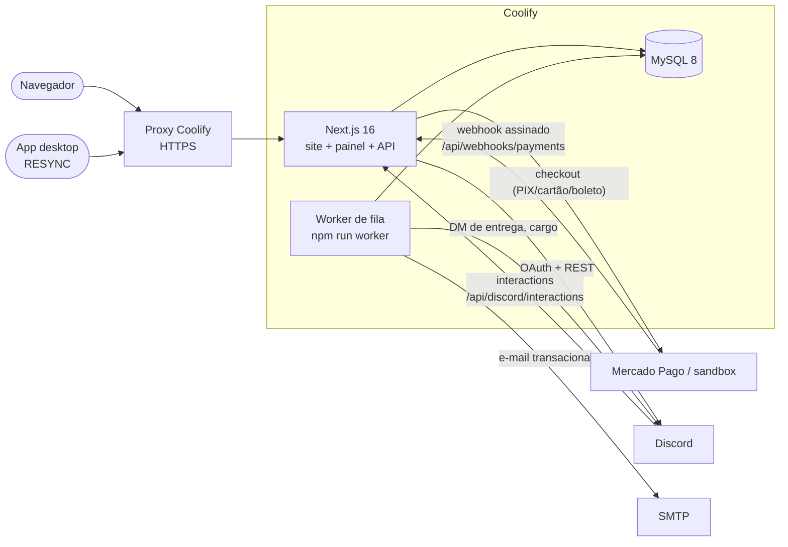

# ARQUITETURA — RESYNC WEB

Visão geral da plataforma de venda e licenciamento. O modelo de dados detalhado está em `BANCO.md`; o passo a passo de deploy, no `README.md`.

## Visão geral

Dois processos, uma imagem Docker:

- **web** — Next.js: páginas públicas, painel do cliente/afiliado/revenda, `/admin`, server actions e rotas de API (`/api/v1/*` para o app desktop, webhooks, OAuth).
- **worker** — consome a tabela `Job` em loop, com retry e backoff exponencial. Entrega e-mails, DMs do Discord, notificações e tarefas agendadas (expiração de licença, aprovação de comissão). Se o worker cair, nada se perde: os jobs ficam `PENDING` no banco até ele voltar.

## Fluxo de compra

1. Visitante escolhe um plano. Se chegou por link de afiliado (`/a/{code}`), o clique é registrado e a atribuição (last-click, janela em dias) gruda no usuário via cookie.
2. `createOrder` monta o pedido: preço de tabela + cupom validado + afiliado resolvido. Tudo em centavos, calculado no servidor.
3. `getPaymentProvider().createCheckout(...)` cria o `Payment` no provedor (Mercado Pago ou sandbox) e devolve QR PIX / URL de redirect.
4. O provedor confirma o pagamento **exclusivamente via webhook** em `/api/webhooks/payments`: assinatura validada, evento gravado em `PaymentEvent` (idempotente por `provider + eventId` — retry do provedor não duplica nada).
5. `processPaymentEvent` (fulfillment) roda em transação: `Payment` → `APPROVED`, `Order` → `PAID`, `issueOrExtendLicense` emite ou estende a licença (chave gerada, hash + ciphertext), comissão de afiliado criada com aprovação agendada para depois da janela de reembolso, jobs enfileirados (e-mail de entrega, DM no Discord, notificação no painel).
6. O worker entrega os jobs. O cliente vê a licença no painel na hora — a entrega assíncrona é cortesia, não pré-requisito.
7. O app desktop ativa a licença em `/api/v1/licenses/activate` (chave + HWID, limite de dispositivos) e mantém `heartbeat`/`validate`.

Reembolso/chargeback seguem o mesmo caminho: webhook → evento idempotente → fulfillment reverte (licença revogada, comissão cancelada, pedido `REFUNDED`/`CHARGEBACK`).

## Decisões

- **MySQL, via Prisma + `@prisma/adapter-mariadb`** — preferência operacional do Coolify (serviço nativo, backups agendados). O client Prisma é gerado em `src/generated/prisma` e importado só de lá.
- **Fila em banco (tabela `Job`) com worker próprio** — zero infraestrutura extra; retry + backoff + estado `DEAD` visível no `/admin`. Redis fica como opção futura se o volume justificar (`REDIS_URL` já reservada).
- **Sessões próprias em cookie httpOnly** — tabela `Session` com IP/user-agent (histórico de acesso e revogação individual). Sem dependência de provedor de auth.
- **Confirmação de pagamento SÓ por webhook assinado** — o redirect do navegador nunca marca pedido como pago. Assinatura inválida = evento registrado e rejeitado.
- **Dinheiro sempre em centavos inteiros** (`Int`) — sem float em caminho financeiro. Formatação só na borda, com `formatCents`.
- **Chave de licença nunca em claro no banco** — `keyHash` (SHA) para lookup na ativação, `keyCiphertext` (AES-GCM com `ENCRYPTION_KEY`) para exibir no painel do dono, `keyMasked` para listagens.
- **Saldo de revenda: ledger é a fonte da verdade** — `ResellerLedger` registra cada movimento; `creditBalanceCents` é cache atualizado na mesma transação.
- **Auditoria em tudo que é sensível** — `AuditLog` com before/after e `reason` obrigatório em ação administrativa.
