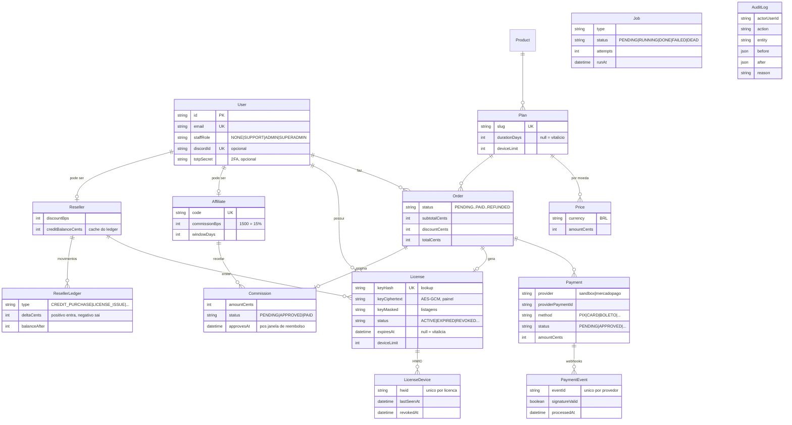

# BANCO DE DADOS — RESYNC WEB

Fonte da verdade: `prisma/schema.prisma`. Este documento é o mapa dos modelos principais e das convenções — não substitui o schema.

## Diagrama (modelos principais)

Fora do diagrama (papéis de apoio): `Session`/`OauthAccount`/`EmailToken` (identidade), `Coupon`/`CouponRedemption` (descontos), `AppVersion`/`Download` (instaladores), `SupportTicket`/`SupportMessage`, `Notification`, `DiscordDelivery`/`WebhookDelivery` (registro de entregas), `Setting`/`FeatureFlag`, `LegalAcceptance`, `AffiliateClick`/`AffiliateAttribution`.

## Convenções

- **Datas em UTC** no banco (default do Prisma). Exibição sempre com `toLocaleString('pt-BR', { timeZone: 'America/Sao_Paulo' })`.
- **Dinheiro em centavos inteiros** (`Int`). Percentuais em basis points (1500 = 15%). Nunca float.
- **Ledger é a fonte da verdade** do saldo de revenda: `Reseller.creditBalanceCents` é cache, atualizado na MESMA transação que grava o `ResellerLedger`. Divergência = bug, e o ledger ganha.
- **Idempotência de webhook**: `PaymentEvent` tem `@@unique([provider, eventId])` — o retry do provedor cai em conflito e não reprocessa.
- **Chave de licença nunca em claro**: `keyHash` para lookup, `keyCiphertext` (AES-GCM) para exibição ao dono, `keyMasked` para listagens.
- **Pedido tem 1 item** (simplificação declarada da v1) — sem tabela `order_items`; o plano está no próprio `Order`.
- **Soft-state por status**, não deleção: pedidos, licenças e usuários mudam de status (`REVOKED`, `SUSPENDED`, `DELETED`) e mantêm histórico.
